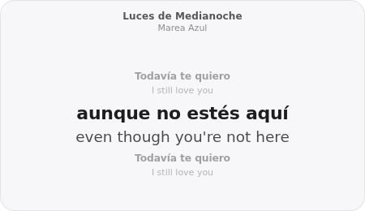
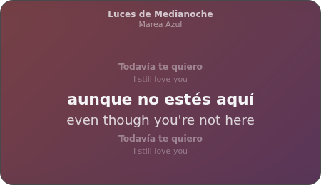
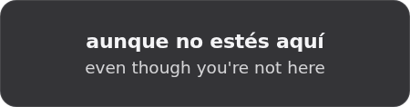
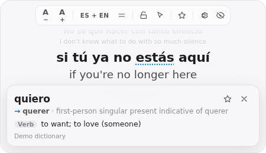
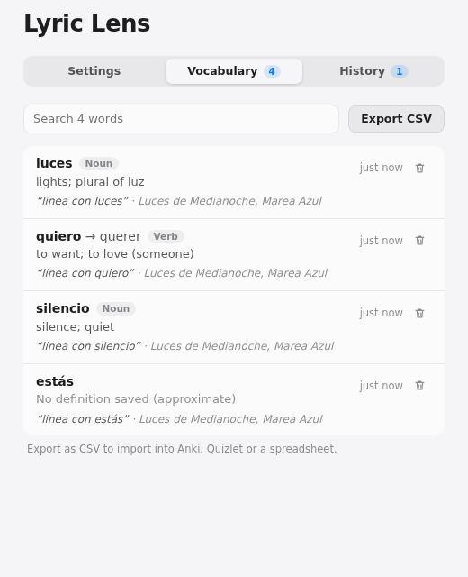
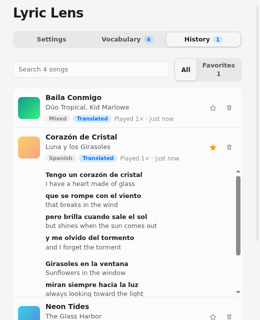
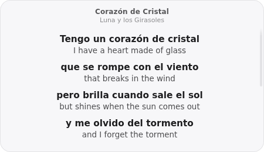
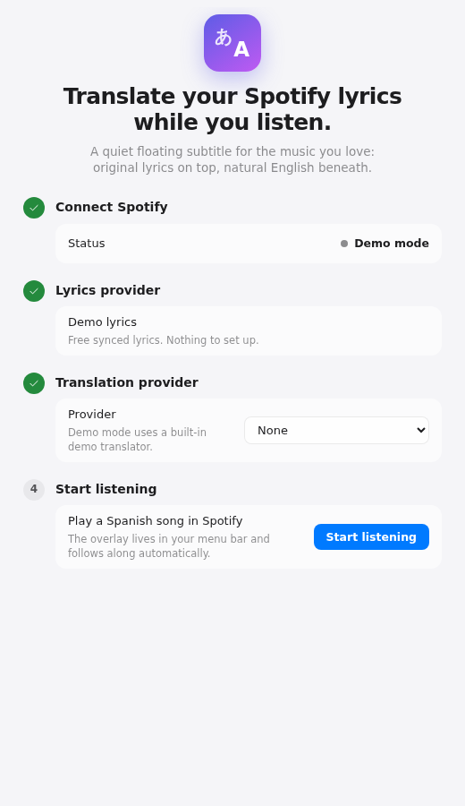
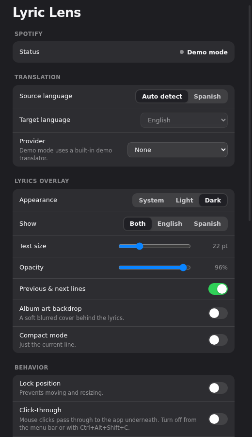

# Lyric Lens

**Desktop subtitles for Spotify.** Lyric Lens watches what you're playing in Spotify, fetches the lyrics, translates Spanish or French into natural English, and shows both in a small, translucent, always-on-top overlay that follows the song line by line.

> Translate your Spotify lyrics while you listen.

It is a *translation companion*, not a player: no play/skip/volume controls, no library management. Spotify plays the music; Lyric Lens helps you understand it.

## Screenshots

Captured from demo mode (`npm run dev:demo`) on Linux, so macOS vibrancy blur isn't visible here.

| Synced lyrics | Dark + album art | Compact |
| --- | --- | --- |
|  |  |  |

| Tap a word | Vocabulary | History |
| --- | --- | --- |
|  |  |  |

| Unsynced lyrics | Onboarding | Settings |
| --- | --- | --- |
|  |  |  |

## Features

- Detects the current Spotify track (title, artists, album, artwork, progress) via the official Web API.
- Retrieves synced (timestamped) lyrics from [LRCLIB](https://lrclib.net); falls back to plain lyrics.
- Detects Spanish, French, English, mixed and other-language songs locally (offline); translates only the lines that need it. Mixed songs keep their English lines as they are.
- Translation providers behind an interface: **DeepL**, **Google Cloud Translation**, or any **OpenAI-compatible** LLM endpoint.
- Caches translations and lyrics on disk: replaying a song never re-translates.
- Floating overlay: always on top (even over full-screen apps), draggable, resizable, adjustable opacity and font size, light/dark/system theme, compact mode, lock position, click-through, optional blurred album-art backdrop.
- **Tap a word** in the overlay for its meaning (dictionary form for conjugations, e.g. *quiero → querer*, *aime → aimer*), and **save it to your vocabulary** with a star. Export the list as CSV for Anki, Quizlet or a spreadsheet.
- **History & favorites:** every song you've read lyrics for is remembered on your Mac. Reopen its lyrics and translation any time, favorite songs with the ★ in the overlay, and clear history without losing favorites.
- Menu bar app with global shortcuts; no Dock icon.
- **Demo mode** with simulated playback, lyrics and translations, so you can try everything with no accounts.

## Requirements

- macOS 12+ (primary target). Windows and Linux builds are architecturally supported but not the focus of the MVP.
- Node.js 20.12+ (developed on 22) and npm.
- A Spotify account and a (free) Spotify developer app.
- _Optional:_ an API key for a translation provider. Without one the overlay shows original lyrics and says so.

## Installation

```bash
git clone https://github.com/evan-div/Spotify-Translator.git
cd Spotify-Translator
npm install
cp .env.example .env      # then fill in what you need (see below)
npm run dev               # launches the app with hot reload
```

Want to look around first? `npm run dev:demo` needs no credentials at all.

## Spotify Developer setup

Spotify's Web API requires you to register an app (free):

1. Open the [Spotify Developer Dashboard](https://developer.spotify.com/dashboard) and choose **Create app**.
2. Name it anything (e.g. "Lyric Lens"). For **APIs used**, tick **Web API**.
3. Add the **Redirect URI** (see next section) and save.
4. Copy the **Client ID**. Put it in `.env` as `SPOTIFY_CLIENT_ID`, or paste it into the onboarding / **Settings → Spotify** field.
5. **Development mode note:** new Spotify apps start in development mode. Only users you add under **User Management** (up to 25) can authorise the app, and Spotify may require the app owner to hold a Premium subscription. Add your own Spotify account there. See [Spotify's quota-modes documentation](https://developer.spotify.com/documentation/web-api/concepts/quota-modes).

Lyric Lens uses the **Authorization Code flow with PKCE**, so **no client secret** is required and none is stored. Requested scopes: `user-read-currently-playing`, `user-read-playback-state` (read-only).

### Spotify redirect URI setup

Add this exact URI to your Spotify app:

```
http://127.0.0.1:8888/callback
```

Spotify no longer accepts `localhost` for redirect URIs; the loopback IP literal `127.0.0.1` is required. Clicking **Connect Spotify** opens your browser; after you approve, Spotify redirects to a tiny one-shot local server inside the app that captures the code and shows a "You're connected" page.

If port 8888 is taken, choose another and set both the Spotify app and `SPOTIFY_REDIRECT_URI` to match.

## Lyrics provider setup

The default provider is **LRCLIB**: free, no account, no API key, with synced lyrics for many songs. There is nothing to configure.

Lyrics sit behind a `LyricsProvider` interface (`src/main/lyrics/LyricsProvider.ts`); the rest of the app only sees the normalised `TrackLyrics` model. To add another source (for example a licensed commercial API), implement the interface and add it to `createLyricsProviders()` in `src/main/app/services.ts`. Providers are tried in order. `LYRICS_API_KEY` is reserved for such keyed providers and unused by LRCLIB.

Song matching handles `feat.`, `- 2011 Remaster`, `(Radio Edit)`, `[Deluxe]`, `- Live at…`, multiple artists, accents and punctuation, and checks duration so timestamps are only trusted for the same recording.

## Translation provider setup

Choose a provider in **Settings → Translation** (or set `TRANSLATION_PROVIDER` / `TRANSLATION_API_KEY` in `.env`). Keys saved in Settings are encrypted with the macOS Keychain (Electron `safeStorage`) and never sent to the renderer process.

| Provider | Get a key | Notes |
| --- | --- | --- |
| DeepL | [deepl.com/pro-api](https://www.deepl.com/pro-api) | Free-plan keys (ending `:fx`) are auto-routed to `api-free.deepl.com`. |
| Google Cloud Translation | [Setup guide](https://cloud.google.com/translate/docs/setup) | Basic (v2) API; key is sent in a header, never a URL. |
| OpenAI-compatible | [platform.openai.com](https://platform.openai.com/api-keys) | Best phrasing for idioms and slang. Set model and base URL to use Azure, OpenRouter or a local server. |

Translation preserves line boundaries and order, translates repeated choruses once (so they stay consistent), and leaves English lines alone in mixed-language songs.

## Environment variables

See [`.env.example`](.env.example). The file is git-ignored; real environment variables win over it.

| Variable | Required | Purpose |
| --- | --- | --- |
| `SPOTIFY_CLIENT_ID` | live mode | Spotify app Client ID (or set it in Settings). |
| `SPOTIFY_REDIRECT_URI` | no | Defaults to `http://127.0.0.1:8888/callback`. Must match the Spotify app. |
| `LYRICS_PROVIDER` | no | `lrclib` (default). |
| `LYRICS_API_KEY` | no | For keyed lyrics providers you add. Unused by LRCLIB. |
| `LYRICS_API_BASE_URL` | no | Self-hosted LRCLIB endpoint. |
| `TRANSLATION_PROVIDER` | no | `deepl`, `google` or `openai`. Settings override. |
| `TRANSLATION_API_KEY` | no | Key for the provider. A key stored via Settings takes precedence. |
| `TRANSLATION_MODEL`, `TRANSLATION_API_BASE_URL` | no | `openai` provider only. |
| `LYRICLENS_DEMO` | no | `1` runs on simulated data. |
| `LOG_LEVEL` | no | `debug`, `info`, `warn`, `error`. |

When installed, place `.env` in `~/Library/Application Support/Lyric Lens/`. Nothing in `.env` is exposed to the renderer.

## Using the app

- **Menu bar icon:** Show/Hide Lyrics, Lock Overlay, Click-Through Mode, Reset Position, Vocabulary, History & Favorites, Settings, Connect/Reconnect Spotify, Refresh Current Song, Quit.
- **Hover the overlay** to reveal controls: text size, Spanish/English/both, compact mode, lock, click-through, settings, hide. Drag anywhere to move; drag the edges to resize.
- **Tap any Spanish word** to open a small definition card over the lyrics. Tap ★ on the card to save the word (saved words are underlined in later lyrics); tap empty space to dismiss it. Dragging the overlay still works: a click and a drag are told apart by movement. Turn this off in Settings → Behavior if you prefer.
- **Vocabulary** (menu bar or Settings → Vocabulary) lists saved words with the lyric line and song each came from, with search and *Export CSV*.
- **History** (menu bar or Settings → History) lists songs you've listened to with lyrics; click one to read the cached lyrics and translation, ★ to favorite, 🗑 to remove. *Clear history* keeps favorites. You can turn history off in Settings → Behavior.
- **Click-through** lets clicks pass to the app underneath. To turn it off: menu bar → *Click-Through Mode*, or the shortcut below.
- **Refresh Current Song** re-fetches lyrics and re-translates, bypassing caches (useful if a match was wrong).

| Global shortcut (macOS) | Action |
| --- | --- |
| ⌥⇧⌘L | Show / hide lyrics |
| ⌥⇧⌘C | Toggle click-through |
| ⌥⇧⌘↑ / ⌥⇧⌘↓ | Larger / smaller text |

Shortcuts are editable in **Settings → Keyboard shortcuts**: click one, press the new combination (Esc cancels, Delete turns it off, ↺ resets it). A shortcut needs at least two modifier keys (or one plus a function key) so it can never hijack everyday shortcuts like ⌘C. If macOS or another app already owns a combination, the row says so instead of failing silently.

## Development commands

```bash
npm run dev           # Electron + Vite with hot reload
npm run dev:demo      # same, on simulated data (no credentials)
npm run typecheck     # strict TypeScript for main, preload and renderer
npm run lint          # ESLint
npm test              # Vitest unit tests
npm run build         # typecheck + production bundles into out/
```

## Production build

```bash
npm run dist          # macOS .dmg and .zip (arm64 + x64) into release/
npm run dist:dir      # unpacked .app for quick local testing
```

Packaged builds are a menu-bar app (`LSUIElement`) with a strict Content-Security-Policy. Distribution outside your own machine requires Apple code signing and notarisation (configure `CSC_*` / `APPLE_*` environment variables for electron-builder).

## Demo mode

Enable with `npm run dev:demo`, `LYRICLENS_DEMO=1`, **Settings → Demo mode**, or "Try the demo" in onboarding. It simulates a playlist that exercises every state: synced Spanish, synced English, unsynced Spanish, mixed Spanish/English, a track with no lyrics, an ad, and a podcast, with pause, resume, seek, skip, and simulated translation latency. Use **Settings → Simulated player** to drive it. Demo code is isolated in `src/main/demo/` and `src/renderer/demo/` and uses in-memory caches, so it never touches your real data. All demo lyrics are short, invented text.

## Architecture overview

```
src/
  shared/      Pure, framework-free logic used by both processes (unit tested)
    types/       Domain models: SpotifyTrack, PlaybackState, TrackLyrics, TrackTranslation, AppSettings…
    utils/       text normalisation, LRC parsing, language detection, PlaybackSyncEngine, track-change detection
  main/        Electron main process (Node)
    app/         AppController (playback → lyrics → translation flow), Application (composition root), service bundles
    spotify/     SpotifyService interface, PKCE auth + loopback callback, API client, adaptive polling
    dictionary/  DictionaryProvider interface, Wiktionary implementation, DictionaryService (cache, dictionary-form lookup, machine fallback)
    library/     VocabularyStore and HistoryStore (JSON files; favorites are never pruned)
    lyrics/      LyricsProvider interface, LRCLIB implementation, candidate matching, LyricsService
    translation/ TranslationProvider interface, DeepL / Google / OpenAI-compatible, provider factory
    pipeline/    LyricsPipeline: cache → lyrics → detect → translate → cache (cancellable)
    cache/       Keyed file caches (one JSON file per key) and cache-key derivation
    storage/     Settings store, secret store (Keychain via safeStorage), settings validation
    windows/     Overlay and settings windows; tray; global shortcuts; IPC handlers
    demo/        Simulated Spotify / lyrics / translation (demo mode only)
  preload/     Narrow contextBridge API: the only door between renderer and main
  renderer/    React UI (overlay, settings, onboarding), plain CSS, no state library
```

Key design points:

- **Swappable providers.** `SpotifyService`, `LyricsProvider`, `TranslationProvider`, `TranslationCache`/`LyricsCache` and `SettingsStore` are interfaces; the UI consumes normalised domain data only.
- **Track detection ≠ lyric timing.** Main polls Spotify every ~2 s (4–5 s when paused/idle; back-off on errors; honours `Retry-After`; an extra poll is scheduled just after a track is due to end). The renderer's `PlaybackSyncEngine` keeps a local clock anchored on the latest sample and reconciles on every update, so pause, resume, seek, skip and API latency are handled. It wakes only at the next line boundary, so there is no busy loop and React re-renders only when the active line changes.
- **Song-change flow.** Track change → UI immediately switches to "Loading lyrics…" (never showing the previous song) → translation cache → lyrics cache → provider → language detection → translation → cache. In-flight work is cancelled if you skip.
- **Security.** `contextIsolation`, `sandbox`, no `nodeIntegration`, no `remote`; a strict CSP when packaged; IPC senders and payloads are validated; secrets never reach the renderer; tokens and API keys are stored via Keychain-backed `safeStorage` (kept in memory only if OS encryption is unavailable).
- **Portability.** OS-specific behaviour (vibrancy, dock hiding, tray template icon, window level) is isolated in `src/main/windows`, `tray.ts` and `main.ts`. Windows falls back to a transparent, CSS-styled panel.
- **Zero runtime dependencies.** Networking uses `fetch`; persistence is plain JSON; React and tooling are build-time only.

## Known limitations

- Developed and tested in a Linux sandbox (real Electron under Xvfb, unit tests, demo mode). **macOS-specific visuals (vibrancy, rounded corners, tray template icon, full-screen overlay behaviour) and the live Spotify / DeepL / Google / OpenAI calls have not been verified against real services.** Expect small fixes on first real-world use.
- Spotify's Web API reports progress with a few hundred ms of jitter; use **Settings → Lyric timing** to nudge if lyrics feel early or late.
- Word definitions come from [Wiktionary](https://en.wiktionary.org)'s REST API (free, no key; content is CC BY-SA). Slang, names and some conjugations may be missing, and French lookups have only been exercised with stubbed responses; if you've configured a translation provider, those words fall back to a short machine translation clearly marked *approximate*. The Wiktionary integration was built against its documented response format and tested with stubbed responses, but not against the live service.
- Lyrics coverage depends on LRCLIB. Some songs will have no lyrics or only unsynced lyrics.
- Spanish → English and French → English are translated. Portuguese is detected so it isn't mistaken for Spanish, but is shown untranslated. To add another source language: add its code to `SourceLanguageCode` and `SOURCE_LANGUAGE_CODES`, give it a marker vocabulary in `src/shared/utils/language.ts`, and add its name to `LANGUAGE_NAMES` (providers, the dictionary and the UI are driven by those).
- Language detection is heuristic; a song with very few recognisable words may be classed "unknown". Use **Source language** in Settings (Auto / Spanish / French) to pin the language and force translation.
- The Spotify Web API does not expose lyrics; this app deliberately never touches Spotify's own lyrics UI.

## API / licensing considerations

- **Spotify:** used only for playback metadata via the supported Web API, under [Spotify's Developer Terms](https://developer.spotify.com/terms). Developer-mode quotas and Premium requirements for app owners may apply.
- **Lyrics are copyrighted.** LRCLIB is a community database; its content is provided without any warranty of licensing, and rights remain with the rightsholders. Lyric Lens fetches lyrics on demand for personal, transient display and caches them locally on your machine only; it never redistributes them. If you plan to distribute the app publicly or commercially, replace or supplement LRCLIB with a licensed provider (for example Musixmatch or LyricFind); the `LyricsProvider` abstraction exists for exactly this. No copyrighted lyrics are committed to this repository; demo and test lyrics are invented.
- **Translation providers** have their own pricing, data-handling and terms. Lyrics are sent to the provider you choose. Each song is translated once and cached.
- Lyric Lens does not scrape Spotify's UI or automate a browser.

## Troubleshooting

| Symptom | Try |
| --- | --- |
| "Add your Spotify Client ID first" | Set `SPOTIFY_CLIENT_ID` or paste it in Settings → Spotify. |
| Spotify error `INVALID_CLIENT: Invalid redirect URI` | The Redirect URI in the Spotify dashboard must match `http://127.0.0.1:8888/callback` exactly (no `localhost`, no trailing slash). |
| "Port 8888 is already in use" | Quit the other program, or use another port in both the dashboard and `SPOTIFY_REDIRECT_URI`. |
| Browser says the user is not registered | In development mode, add your account under **User Management** in the Spotify dashboard. |
| Overlay shows "Nothing is playing" while music plays | Spotify's API only reports an *active* device; press play in Spotify once. Podcasts/ads have no lyrics. |
| "No lyrics found" | LRCLIB may not have the song. Try **Refresh Current Song**, or add another provider. |
| Original lyrics but no translation | Add a translation provider and key in Settings (the overlay says which), or check the key with **Test**. |
| Lyrics early/late | Settings → Lyric timing. |
| Can't click things under the overlay / can't click the overlay | Toggle click-through from the menu bar or ⌥⇧⌘C. |
| Overlay off-screen after changing monitors | Menu bar → Reset Overlay Position. |
| Something odd | Logs are in `~/Library/Application Support/Lyric Lens/logs/main.log`. Run with `LOG_LEVEL=debug`. |

To clear caches, delete `~/Library/Application Support/Lyric Lens/cache/`. Your vocabulary and history live in `vocabulary.json` and `history.json` in the same folder (they are separate from the caches, so clearing caches never deletes them).

## Future ideas

The structure leaves room for Windows polish, Apple Music / YouTube Music sources, more target languages, romanisation, word-by-word translation, tap-a-word definitions and vocabulary saving, lyrics history and favourites, manual lyric/translation corrections, AI slang explanations, translation tone options, a karaoke/full-screen mode, and editable shortcuts.
